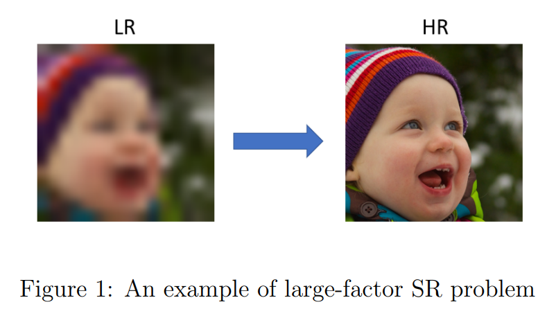
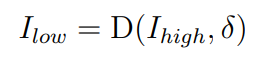
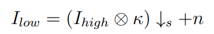
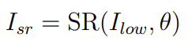
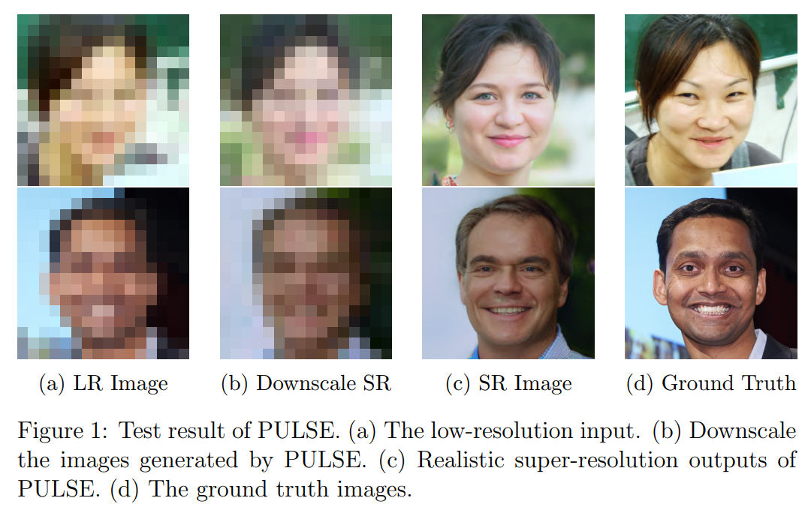
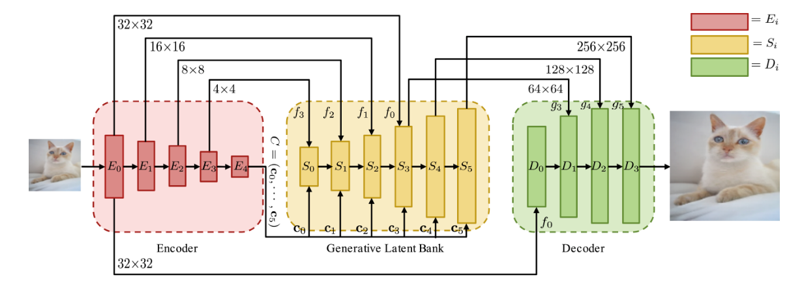
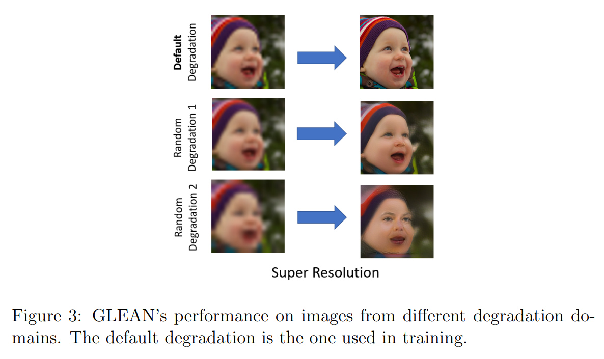

By Hong

This summer, I have a chance to work on a research project under the supervision of [Professor Gary](https://www.cse.ust.hk/~gchan/) in HKUST. My task is to improve the image quality of surveillance cameras in different settings (streets, parking lot, etc). Thus, I start to self-study super-resolution techniques. I would like to share what I have learned along the way in this series of blog posts. 

## Introduction

Super-resolution aims at reconstructing sharp and high-resolution (HR) images from corresponding blurry and low-resolution counterparts. The ability to enhance perceptual quality of images has many practical usages, such as security, surveillance, and medical images. In addition, SR also helps to improve other computer vision tasks, such as object detection, face recognition, and image classification. The rest of this article I will first describe the general problem setting of SR. Next, two state-of-the-art SR methods and their limitation will be introduced. 

## Problem Setting

Single image super-resolution(SISR) aims at recovering the corresponding high-resolution image from a low-resolution image. Generally, the low-resolution image Ilow is modeled as the output of the degradation process:

where D is the degradation function and δ denotes the parameters of D. In practice, the degradation process is often modeled as:

where Ihigh ⊗ κ represents the convolution between a blur kernel κ and highresolution image Ihigh, and n is some Gaussian noise. 

We want to recover a high-resolution approximation Isr of the ground truth Ihigh from the Ilow:

where SR is the super-resolution model and θ denotes the parameters of SR.

## Single Image Super-Resolution

### PULSE
Recent advancement in GAN[1, 3, 7] have allowed high-quality image generation. For instance, StyleGAN [4] can generate realistic face images with rich texture details. To solve large-scale factors super-resolution problem, PULSE [6] utilizes pre-trained StyleGAN to find high-quality images that
downscale well to Ilow by exploring the latent space of StyleGAN. The benefit of this method is that it is unsupervised and no additional training is needed. In addition, it will find realistic images that downscale correctly. However, its drawback is that it can not faithfully recover the structure of the ground truth as shown in the figure below.

### GLEAN

GLEAN [2] also utilizes pre-trained StyleGAN [5] for the upscaling task. The difference is that it trains a generator for the task with a encoder-bankdecoder architecture. While training, I_low will first be encoded using convolution layers. Next, the StyleGAN will act as a generative latent bank for texture and detail generation based on the encoded features. Last, a decoder is employed for upsampling by integrating the output features of the encoder and the latent bank using convolution and pixel-shuffle layers [8]. GLEAN shows clear improvement in reconstructing photorealistic high-resolution images with large-scale factors. Nevertheless, since images pairs are needed for supervised training, its performance may degrade significantly if the Ilow is generated from degradation process other then the model has assumed as shown in the figure below. 

---

In this blog post, I briefly discuss the problem setting for image super-resolution and two SOTA GAN-based models for the problem and their limitation. In my next [post](https://hong-yc.github.io/blogs/VideoSuperRes), I will go discuss the use of super-resolution on video. 

## Reference

[1] M. Arjovsky, S. Chintala, and L. Bottou. Wasserstein gan, 2017.

[2] K. C. K. Chan, X. Wang, X. Xu, J. Gu, and C. C. Loy. Glean: Generative latent bank for large-factor image super-resolution, 2020.

[3] I. J. Goodfellow, J. Pouget-Abadie, M. Mirza, B. Xu, D. Warde-Farley,
S. Ozair, A. Courville, and Y. Bengio. Generative adversarial networks,
2014.

[4] T. Karras, S. Laine, and T. Aila. A style-based generator architecture
for generative adversarial networks, 2019.

[5] T. Karras, S. Laine, M. Aittala, J. Hellsten, J. Lehtinen, and T. Aila.
Analyzing and improving the image quality of stylegan, 2020.

[6] S. Menon, A. Damian, S. Hu, N. Ravi, and C. Rudin. Pulse: Self-supervised photo upsampling via latent space exploration of generative
models, 2020.

[7] A. Radford, L. Metz, and S. Chintala. Unsupervised representation
learning with deep convolutional generative adversarial networks, 2016..

[8] W. Shi, J. Caballero, F. Husz´ar, J. Totz, A. P. Aitken, R. Bishop,
D. Rueckert, and Z. Wang. Real-time single image and video super-resolution using an efficient sub-pixel convolutional neural network,
2016.
