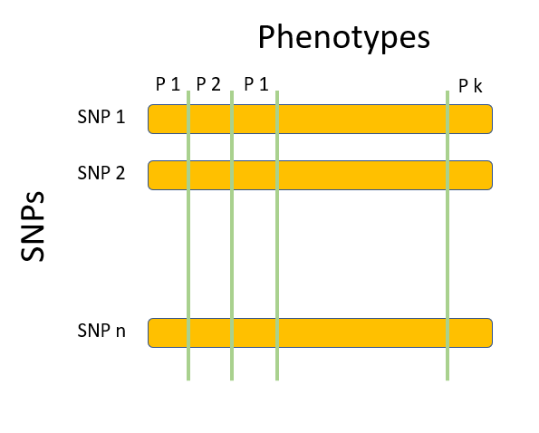
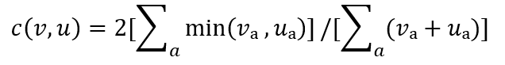

By Hong

The recent advance in DNA sequencing techniques allows scientists to obtain the secret code behind every living creature, which gives us the superpower to understand the constitution of life. Yet, the DNA sequences often contain a huge amount of information, which is very computation-intensive and time-consuming to analyze. Fortunately, with the help of parallel computing, these processes can be speedup significantly. In this blog post, I would like to examine the use of parallel computing in the field of bioinformatics. To be more specific, I will elaborate on how parallel computing allows scientists to find the statistical association between genetic variants and measured phenotypes. I will start with a brief introduction to the purpose of analyzing genetic data. Next, the computational challenge will be presented. Then, parallelism techniques making the problem tractable will be discussed. Last, I will introduce the computing system used to solve the problem and analyze its performance.  

Humans share 99.9% of their genetic makeup, meaning only 0.1% of our entire DNA is responsible for the diversity we see between individuals. A specific variance on the same location across human DNA is called a single nucleotide polymorphism (SNP). SNPs are keys in understanding the genetic causing for human phenotypes, the set of traits or observable characteristics, including genetic diseases. Thus, by performing association analyses of human genetic data, scientists can discover the genetic roots of certain diseases. Methods such as GWAS and PheWAS can give us a matrix of significant associations between variants and phenotypes, where rows correspond to SNPs and columns are phenotypes. The entry in a SNP vectors represents the significance of association between that SNP and the corresponding phenotype. 

By performing pairwise comparisons of these vectors, scientists can discover phenotypes affected by similar genetic variances or groups of genetic elements that affect similar phenotypes. The Proportional Similarity metric is one of the commonly used methods for vectors comparisons. For two vectors, v & u, their Proportional Similarity metric is calculated as: 

Yet, these kinds of studies are computationally expensive, since if there are n vectors, n square of vector comparisons are required. In addition, due to the advance in genome sequencing techniques, there is a surge in the availability of genomic data. For example, one of the publicly available human genome datasets contains over 80 million SNPs and 16000 phenotypes. The computation for the Proportional Similarity metric of all pairs of SNPs alone requires around 10 to the 16th power of vector comparisons. Moreover, these kinds of computations need to be done hundreds of thousands of times to obtain the associations between multiple SNPs and phenotypes. Therefore, parallelized algorithms and large-scale high-performance computing systems need to be employed to execute this kind of scientific study.

Researchers from Oak Ridge National Laboratory come up with an algorithm, CoMet, for tackling this problem. CoMet is a hybrid model written in C++ and utilize CUDA, MPI and a dense linear algebra library called MAGMA. Two kinds of parallelism are utilized. The first axe of parallelism is in the vector elements.  An SNP vector is split into multiple parts before assigned to different compute nodes. The second axe of parallelism is in the vector number.  Different subsets of vectors are distributed to different compute nodes. By carefully designing the calculation each node performs and how and what information each node needs to communicate, the researchers manage to decrease the percentage of redundant operations and achieve an efficient implementation. 

The algorithm is then run on the supercomputer, Summit, the 2nd fastest system in the world. Summit, with a theoretical peak FLOPs of 200,795 TFlops, is composed of 4,608 compute nodes each equipped with 2 IBM POWER9 CPUs and 6 Nvidia Tesla GPUs. Each node contains over 600 GB of shared memory which is addressable by all CPUs and GPUs. The nodes are connected in a fat-tree topology by a dual-rail Mellanox EDR InfiniBand, providing a high data throughput rate. 

The CoMet algorithm can achieve 81% of theoretical peak operation rates, which allows it to perform a staggering five quadrillion vector element comparisons per second. Running CoMet on Summit for one-hour complete tasks that would require 35 years on a competing supercomputer or 12,000 years on a laptop. These allow scientists to conduct experiments that were considered far beyond what is possible until recently. By utilizing the algorithm and parallel computing system, researchers can now find the associations between a set of genetic variance and diseases, which can benefit humankind in all sorts of aspects, including drug discovery, facilitating genetic target selection, and better-predicting side effects of certain treatments.

## Reference

1.	https://en.wikipedia.org/wiki/Summit_(supercomputer)
2.	https://top500.org/system/179397/
3.	https://blogs.nvidia.com/blog/2019/05/20/opioid-genomics-summit-supercomputer/
4.	W. Joubert, J. Nance, D. Weighill, and D. Jacobson, “Parallel Accelerated Vector Similarity Calculations for Genomics Applications” 
5.	Joubert, Wayne, Weighill, Deborah A., Kainer, David, Climer, Sharlee, Justice, Amy, Fagnan, Kjiersten, and Jacobson, Daniel A. “Attacking the Opioid Epidemic: Determining the Epistatic and Pleiotropic Genetic Architectures for Chronic Pain and Opioid Addiction
