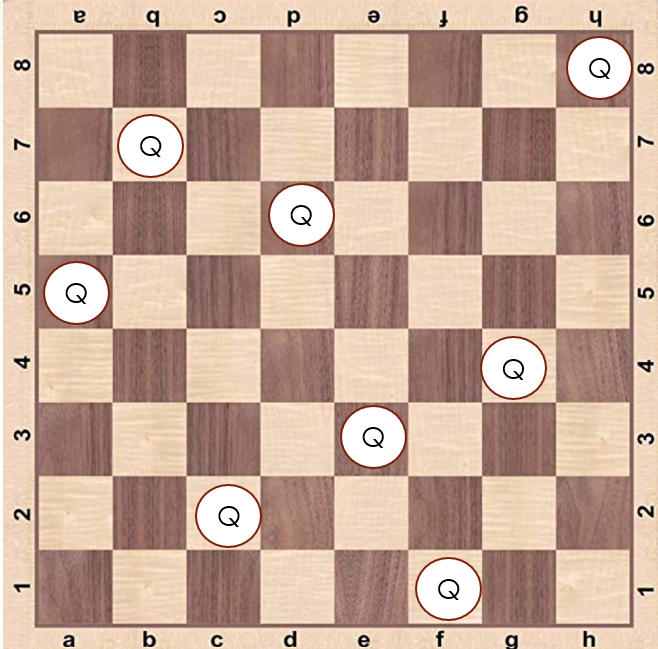
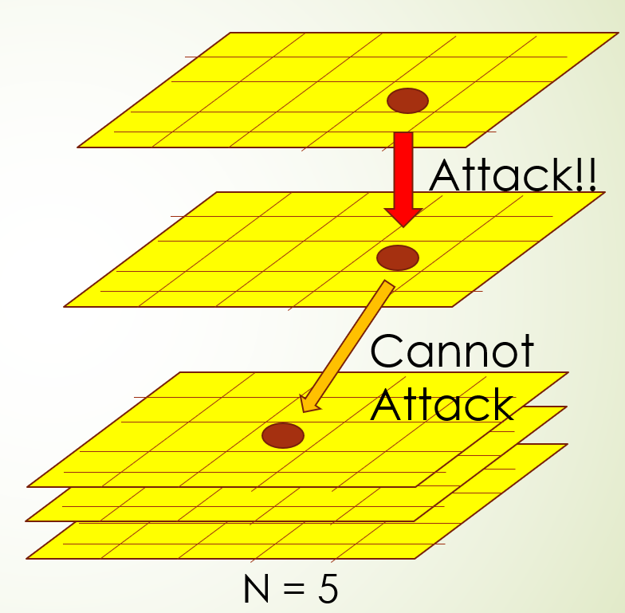

By Hong

The N-Queens problem [1] is to determine the placement of N Queens on an N × N chessboard such that no two queens can attack each other (A Queen can attack vertically, horizontally, or diagonally). It has many real-world applications such as traffic control, circuit design, computer task scheduling, etc.

The N-Queens problem can be extended by adding a new dimension. In the 3D N-Queens problem, chessboards are stacked up vertically and the queen can attack vertically in the new dimension (Shown in the image below)

Chakiat et al[2] has proposed the double backtracking algorithm to obtain a single solution to the 3D N-Queens problem. However, finding all solutions for the problem is very computationally expensive even for small N. In this project, we try to speed up the process of finding all solutions by modifying the algorithm and utilizing parallelization libraries including **OpenMP** and **OpenMPI**. The detail of our project can be found [**here**](https://github.com/Hong-YC/Parallelized-Approach-to-the-N-Queen-Problem-in-Three-Dimension/blob/main/Report.pdf). One can also try out the experiment by downloading the code [**here**](https://github.com/Hong-YC/Parallelized-Approach-to-the-N-Queen-Problem-in-Three-Dimension).

## Reference

[1] M. Bezzel. Proposal of 8-queens problem. Berliner Schachzeitung, 3(363):1848, 1848.

[2] A. Chakiat, A. Sudhakaran, A. A., and P. Venkatesh. A novel double backtracking approach to the
n-queens problem in three dimensions. International Journal of Computer Applications, 169:1–5, 07
2017.